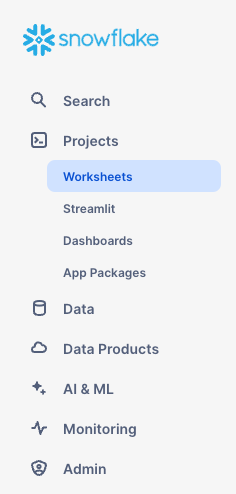
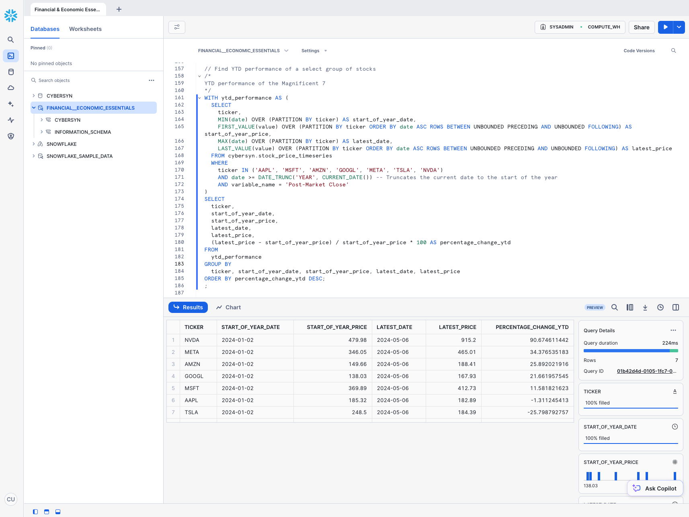
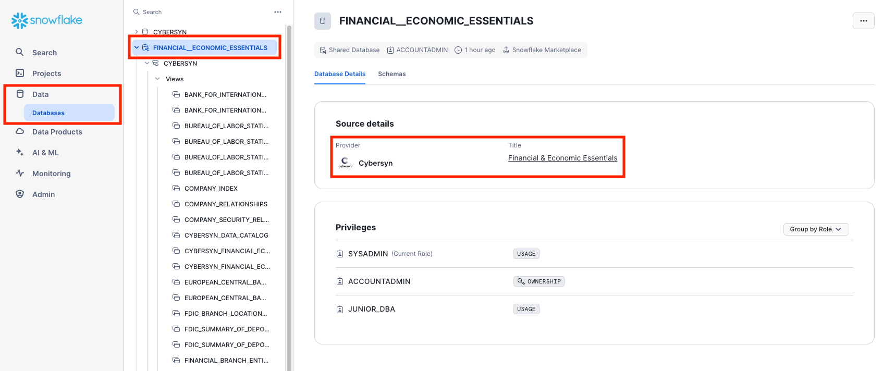

# Zero to Chat with Your Snowflake Data in 120 Minutes #

<!-- ------------------------ -->

## Introduction ##

> Based on the [Zero to Snowflake Quickstart](https://github.com/Snowflake-Labs/sfquickstarts/blob/master/site/sfguides/src/getting_started_with_snowflake/getting_started_with_snowflake.md) enhanced with:
> - an LLM Chatbot borrowed from [Frosty: Build an LLM Chatbot in Streamlit on your Snowflake Data](https://quickstarts.snowflake.com/guide/frosty_llm_chatbot_on_streamlit_snowflake/#0)
> - a Visualization implementaiton from [LLM-Driven Plotting in Streamlit in Snowflake (SiS)](https://www.youtube.com/watch?v=WwH8pejGMPI) 

This entry-level lab, designed for database and data warehouse administrators and architects, will give you a brief introduction to Snowflake and will demonstrate Snowflake Cortex LLM functionality with:
- a text-to-SQL Chatbot
- a text-to-Python Chart Creator

### Prerequisites ###
- Basic knowledge of SQL, database concepts, and objects
- Familiarity with CSV (comma-delimited) files and JSON semi-structured data

## What You'll Learn ###
We will use a Snowflake Enterprise edition account for this lab which has been pre-configured with databases, virtual warehouses and some additional objects to give us enough time to dig into the Snowflake Cortex LLM and Streamlit components of the lab. The lab will focus on:

- How to create stages, tables and views.
- How to load structured and semi-structured data.
- How to perform analytical queries on data in Snowflake, including joins between tables.
- How to clone objects.
- How to undo user errors using Time Travel.
- How to create a Streamlit app
- How to leverage Cortex AI queries to create your own Chatbot in Streamlit
- How to use Cortex AI to ask questions about your data (text-to-SQL)
- How to use Cortex AI to generate visualizations of data (text-to-Python)

> **SCREENSHOTS, SAMPLE CODE AND ENVIRONMENTS in this lab depict examples; results may vary slightly from what you see when you complete the exercises.**

### Data You'll Use ###
**Cybersyn** is a next generation data company creating a real-time view of the world's economy with analytics-ready data exclusively on Snowflake Marketplace. Initially focused on consumer insights, Cybersyn enables you to access external data directly in your Snowflake instance — no ETL required.

This lab will use the following Cybersyn datasets:
- Daily stock price data
- SEC 10-K & 10-Q filings
- Company metadata

Check out Cybersyn's [Consumer Spending product](https://app.snowflake.com/marketplace/listing/GZTSZ290BUX62/) and [explore all 60+ public sources](https://app.cybersyn.com/data_catalog/?utm_source=Snowflake+Quickstart&utm_medium=organic&utm_campaign=Snowflake+Quickstart) Cybersyn offers on the [Snowflake Marketplace](https://app.snowflake.com/marketplace/providers/GZTSZAS2KCS/Cybersyn).
<!-- ------------------------ -->


## Lab Environment Access ##
Each lab participant should have received a number when you arrived to allow you to access your own workspace in Snowflake.

Open a browser window and access the URL:

> https://app.snowflake.com/umnxxyz/lab_data_chat

> IMPORTANT: As soon as you log in, you will be prompted to change your password. Your new password must be at least 8 characters long and contain at least 1 number, 1 uppercase and 1 lowercase letter.
> 
> PLEASE NOTE DOWN THE NEW PASSWORD AS YOU WILL NEED IT LATER!


Log in with these credentials (replace the `<NUMBER>` with the number you were assigned):
```text
Username: LAB_USER_<NUMBER>
Password: LAB123
```

> When you login, you will be prompted to setup multifactor authentication. While this is a best practice and it is strongly recommended that you do that, we will be skipping it for the purposes of the lab, so just click on the `Not now` at the bottom left of the prompt.

<!-- ------------------------ -->

## The Snowflake User Interface ##

### Navigating the Snowflake UI ###

Let's get you acquainted with Snowflake! This section covers the basic components of the user interface.

### Projects > Worksheets ###



Under **Projects** on the left-hand panel, select the ​**Worksheets​** tab. This provides an interface for submitting SQL queries, performing DDL and DML operations, and viewing results as your queries or operations complete. A new worksheet is created by clicking **`+`** on the top right.


### Worksheet Structure  ###


The top left corner contains the following:
- **Snowflake** icon: Use this to get back to the main console/close the worksheet.
- **Worksheet_name** drop-down: The default name is the timestamp when the worksheet was created. Click the timestamp to edit the worksheet name. The drop-down also displays additional actions you can perform for the worksheet.
- **Filters** button: Custom filters are special keywords that resolve as a subquery or list of values.

The top right corner contains the following:
- **Context** box: This lets Snowflake know which role and warehouse to use during this session. It can be changed via the UI or SQL commands.
- **Share** button: Open the sharing menu to share to other users or copy the link to the worksheet.
- **Play/Run** button: Run the SQL statement where the cursor currently is or multiple selected statements.

The middle pane contains the following:
- Drop-down at the top for setting the database/schema/object context for the worksheet.
- General working area where you enter and execute queries and other SQL statements. 

The middle-left panel contains the following:
- **Worksheets** tab: Use this tab to quickly select and jump between different worksheets
- **Databases** tab: Use this tab to view all of the database objects available to the current role
- **Search** bar: database objects browser which enables you to explore all databases, schemas, tables, and views accessible by the role currently in use for the worksheet. 

The bottom pane displays the results of queries and other operations. Also includes 4 options (**Object**, **Query**, **Result**, **Chart**) that open/close their respective panels on the UI. **Chart** opens a visualization panel for the returned results. More on this later.

The various panes on this page can be resized by adjusting their sliders. If you need more room in the worksheet, collapse the database objects browser in the left panel. Many of the screenshots in this guide keep this panel closed.

> **`Note`**: To save time, we'll use pre-written SQL statements in this lab, all provided within a worksheet `ZERO_TO_CHAT_WITH_YOUR_DATA`. 

### Projects > Notebooks ###

The **Notebooks** are Snowflake's implementation of Jupyter Notebooks, a powerful tool for data science that allow us to create a sequential mix of Markdown, SQL and Python cells to walk us through a complete data exploration or manipulation process.

Under **Projects** on the left-hand panel, select the **Notebooks** tab.


### Notebooks Structure ###


Here’s a breakdown of what each section outlined in red in the Snowflake notebook:

**Left Panel (Files and Databases)**:

- `Files Tab`: This section shows the available files within your Snowflake environment, including any notebooks you've created or are currently working on. You can manage and access your files, and it also allows you to connect a Git repository for version control and collaboration.
- `Databases Tab`: Here, you can browse through the databases associated with your Snowflake account. It lets you explore tables, views, and other database objects, allowing you to query and analyze data directly from your notebook.

**Main Code Area (Center Panel)**:

- `Code Cells`: The central part of the screen is where you write and execute code. This area contains cells that can be set to different modes, such as SQL, Python, or Markdown, depending on the task you are performing. You can execute these cells individually, allowing for step-by-step data analysis or script execution.

**Top Right Panel (Toolbar)**: 
- `The toolbar` offers controls for managing the notebook environment. You can add or remove packages, start or stop the execution environment, and run all code cells at once. This section helps manage the workflow, ensuring smooth execution of tasks within the notebook.

### Projects > Dashboards ###

Under **Projects** on the left-hand panel, select the ​**Dashboards​** tab. This tab allows you to create flexible displays of one or more charts (in the form of tiles, which can be rearranged). Tiles and widgets are produced by executing SQL queries that return results in a worksheet. Dashboards work at a variety of sizes with minimal configuration.


### Data > Databases ###

Under **Data**, the **Databases**​ tab shows information about the databases you have created or have permission to access. You can create, clone, drop, or transfer ownership of databases, as well as load data in the UI. Notice that a `CHAT_WITH_YOUR_DATA` database already exists in your environment. You will also see the Cybersyn `FINANCIAL__ECONOMIC_ESSENTIALS` database which has been shared with you.


### Data Products > Marketplace ###

The **Marketplace** tab is where any Snowflake customer can browse and consume data sets made available by providers. There are two types of shared data: Public and Personalized. Public data is free data sets available for querying instantaneously. Personalized data requires reaching out to the provider of data for approval of sharing data.


### Data Products > Private Sharing ###

Under **Data Products**, the **Private Sharing** tab is where data sharing can be configured to easily and securely share Snowflake tables among separate Snowflake accounts or external users, without having to create a copy of the data.


### Monitoring > Query History ###

Under **Monitoring** there are multiple tabs for tracking your usage of your Snowflake account:

- **Query History** is where previous queries are shown, along with filters that can be used to hone results (user, warehouse, status, query tag, etc.). View the details of all queries executed in the last 14 days from your Snowflake account. Click a query ID to drill into it for more information.
- **Copy History** shows the status of copy commands run to ingest data into Snowflake.
- **Task History** allows you to see the execution history for tasks and tasks graphs. (Tasks let you schedule the execution of SQL code. It is associated with a specific database and schema.)
- **Dynamic Tables** is where you can use Snowsight to monitor dynamic table refreshes and examine dynamic tables and dynamic table graphs.
- **Governance** tracks row- and column-level security, object tagging, data classification, access history, and more.


### Admin > Warehouses ###

>  To see all the information available under the `Admin` menu, switch your role to `ACCOUNTADMIN`.

Under **Admin**, the **​Warehouses​** tab is where you set up and manage compute resources known as virtual warehouses to load or query data in Snowflake. A warehouse called `LAB_USER_WAREHOUSE_<NUMBER>` already exists in your environment.


### Admin > Cost Management ###

Under **Admin**, the **Cost Management** tab shows an overview of account consumption and budgets. It also includes details on all the resource monitors that have been created to control the number of credits that virtual warehouses consume. For each resource monitor, it shows the credit quota, type of monitoring, schedule, and actions performed when the virtual warehouse reaches its credit limit.


### Admin > Users & Roles ###

The **Roles** sub-tab of the **Users & Roles** tab shows a list of the roles and their hierarchies. Roles can be created, reorganized, and granted to users in this tab. The roles can also be displayed in tabular/list format by selecting the **Table** sub-tab.


#### Users ####

The **Users** sub-tab of the **Users & Roles** tab shows a list of users in the account, default roles, and owner of the users. For a new account, no records are shown because no additional roles have been created. Permissions granted through your current role determine the information shown for this tab.


Clicking on your username in the bottom right of the UI allows you to change your password, roles, and preferences. Snowflake has several system defined roles. You are currently in the default role of `LAB_USER_ROLE_<NUMBER>` (replace the `<NUMBER>` with the number you were assigned).


> For additional information on Snowflake's role-based access control (RBAC) model, see the [Snowflake documentation](https://docs.snowflake.net/manuals/user-guide/security-access-control.html)

## Data Lab: Stock Price & SEC Filings Data ##

### The Lab Story ###
You work at a grocery retailer. You want to understand the performance of major consumer goods (CPG) companies in the US that supply your store. This lab takes a look at daily stock price data and quarterly and annual Securities Exchange Commission (SEC) company filings to understand the performance of the CPG landscape. Public companies are required to submit a quarterly and annual report to the SEC detailing their financial data.

We will start by collecting data from three different sources:
1. Load company metadata `.csv` file.
2. Load SEC filings from a semi-structured JSON format.
3. Use a Snowflake Marketplace dataset from Cybersyn to find free stock price data.

<!-- ------------------------ -->

## Loading Structured Data into Snowflake: CSVs ##

Let's start by preparing to load structured `.csv` data into Snowflake.

We are using company metadata developed from the Securities and Exchange Commission (SEC) that details the consumer packaged goods (CPG) companies we want to evaluate. The data has been exported and pre-staged for you in an Amazon AWS S3 bucket in the US-EAST region. It is in comma-delimited format with a single header line and double quotes enclosing all string values, including the field headings in the header line. This will be important when we configure the Snowflake table to store this data.

> **Free Datasets from Cybersyn direct to your Snowflake instance:** The full dataset is available [**for free**](https://app.snowflake.com/marketplace/listing/GZTSZAS2KF7) in Snowflake Marketplace from Cybersyn -- no ETL required. For the purposes of this demo, we will focus on working with a subset of the data, staged in a csv file to learn how to load structured data into Snowflake.

**Getting Data into Snowflake**
Data can be ingested into Snowflake from many locations by using the `COPY` command, Snowpipe auto-ingestion, external connectors, or third-party ETL/ELT solutions. For more information on getting data into Snowflake, see the [Snowflake documentation](https://docs.snowflake.net/manuals/user-guide-data-load.html). For the purposes of this lab, we use the `COPY` command and AWS S3 storage to load data manually. In a real-world scenario, you would more likely use an ETL solution or grab data directly from the Snowflake Marketplace!

### Preparing to Run the Lab Queries ###
Now navigate to the **Worksheets** screen. The queries we will be using have been prepared in a Snowflake Worksheet named `ZERO_TO_CHAT_WITH_YOUR_DATA`. This is the "master" worksheet owned by the lab admin. We will create a copy of that worksheet and use our individual copies.


* Open the `ZERO_TO_CHAT_WITH_YOUR_DATA` worksheet
* In the left navigation panel, click on three dots `...` which appear to the right of the worksheet name and select `Duplicate`, then close the original Worksheet.

We need to set the context appropriately within the new Worksheet. In the upper right corner of the worksheet, click the box to the left of the **Share** button to show the context menu. Here we control the elements you can see and run from each worksheet. We are using the UI here to set the context. Later in the lab, we will accomplish the same thing via SQL commands within the worksheet.

Select the following context settings:

**Role:** `LAB_USER_<NUMBER>`
**Warehouse:** `LAB_USER_WAREHOUSE_<NUMBER>`


Finally, we need to select the database and schema context of our worksheet. We'll run a group of queries:
  * Highlight the group of queries at the top of the worksheet and click the "Play" ▶️ button at the top right of the worksheet.
  * The header of the worksheet should show the selected database and schema like `CHAT_WITH_YOUR_DATA.WORKSPACE_<NUMBER>`

### Create Our First Table ###
>  **Data Definition Language (DDL) operations are free!**
All the DDL operations we have done so far do not require compute resources, so we can create all our objects for free.

To make working in the worksheet easier, let's rename it. In the top left corner, double-click the worksheet name, which is the timestamp when the worksheet was created, and change it to `CHAT_WITH_MY_DATA`.

Next we create a table called `COMPANY_METADATA` to use for loading the comma-delimited data. We use the worksheet to run the DDL that creates the table:

```SQL
CREATE OR REPLACE TABLE company_metadata
(cybersyn_company_id string,
company_name string,
permid_security_id string,
primary_ticker string,
security_name string,
asset_class string,
primary_exchange_code string,
primary_exchange_name string,
security_status string,
global_tickers variant,
exchange_code variant,
permid_quote_id variant);
```

>  **Many Options to Run Commands.**
SQL commands can be executed through the UI, via the **Worksheets** tab, using our SnowSQL command line tool, with a SQL editor of your choice via ODBC/JDBC, or through our other connectors (Python, Spark, etc.).
As mentioned earlier, to save time, we are performing most of the operations in this lab via pre-written SQL executed in the worksheet as opposed to using the UI.

Run the query by placing your cursor anywhere in the SQL text and clicking the blue **Play/Run** button in the top right of the worksheet. Or use the keyboard shortcut [Ctrl]/[Cmd]+[Enter].

Verify your `COMPANY_METADATA` table has been created. At the bottom of the worksheet, you should see a Results section displaying a `"Table COMPANY_METADATA successfully created"` message.


Navigate to the **Databases** tab by clicking the **HOME** icon in the upper left corner of the worksheet. Then click **Data** > **Databases**. In the list of databases, click `CHAT_WITH_YOUR_DATA` > `WORKSPACE_<NUMBER>` > `Tables` to see your newly created `COMPANY_METADATA` table. If you don't see any databases on the left, expand your browser because they may be hidden.


* In the left navigation panel, hover over the `COMPANY_METADATA` table and, in the flyout, click on the `Open Table details in new tab` pop-out button in the top right corner. In the new tab, click on the **Columns** tab to see the table structure you just created.


### Create an External Stage ###

We are working with structured, comma-delimited data that has already been staged in a public, external S3 bucket. Before we can use this data, we first need to create a _stage_ that specifies the location of our external bucket.

>  For this lab, we are using an AWS-East bucket. To prevent data egress/transfer costs in the future, you should select a staging location from the same cloud provider and region as your Snowflake account.

Back in the `CHAT_WITH_MY_DATA` worksheet, create the stage by executing the following SQL statement:

```SQL
-- Create the company metadata stage
CREATE OR REPLACE  STAGE cybersyn_company_metadata
    URL = 's3://sfquickstarts/zero_to_snowflake/cybersyn-consumer-company-metadata-csv/';
```

> Make sure to include the final forward slash (`/`) at the end of the URL or you will encounter errors later when loading data from the bucket.

> The S3 bucket for this lab is public so you can leave the credentials options in the statement empty. In a real-world scenario, the bucket used for an external stage would likely require key information.


Now let's take a look at the contents of the `cybersyn_company_metadata` stage:

```SQL
-- List the contents of the company metadata stage
LIST @cybersyn_company_metadata;
```

In the results in the bottom pane, you should see the list of files in the stage:


### Create a File Format ###

Before we can load the data into Snowflake, we have to create a file format that matches the data structure. In the `CHAT_WITH_MY_DATA` worksheet, run the following command to create the file format:

```SQL
-- Create a CSF file format
CREATE OR REPLACE FILE FORMAT csv
    TYPE = 'CSV'
    COMPRESSION = 'AUTO'  -- Automatically determines the compression of files
    FIELD_DELIMITER = ','  -- Specifies comma as the field delimiter
    RECORD_DELIMITER = '\n'  -- Specifies newline as the record delimiter
    SKIP_HEADER = 1  -- Skip the first line
    FIELD_OPTIONALLY_ENCLOSED_BY = '\042'  -- Fields are optionally enclosed by double quotes (ASCII code 34)
    TRIM_SPACE = FALSE  -- Spaces are not trimmed from fields
    ERROR_ON_COLUMN_COUNT_MISMATCH = FALSE  -- Does not raise an error if the number of fields in the data file varies
    ESCAPE = 'NONE'  -- No escape character for special character escaping
    ESCAPE_UNENCLOSED_FIELD = '\134'  -- Backslash is the escape character for unenclosed fields
    DATE_FORMAT = 'AUTO'  -- Automatically detects the date format
    TIMESTAMP_FORMAT = 'AUTO'  -- Automatically detects the timestamp format
    NULL_IF = ('')  -- Treats empty strings as NULL values
    COMMENT = 'File format for ingesting data for zero to snowflake';
```


Verify the file format has been created with the correct settings by executing the following command:

```SQL
-- List file formats
SHOW FILE FORMATS;
```

The file format created should be listed in the result:


### Use a Warehouse for Data Loading ###

We will now use a virtual warehouse and the `COPY` command to initiate bulk loading of structured data into the Snowflake table we created.

> **NOTE:** For this lab, the user is granted access to a pre-established warehouse designed specifically for their use.

Compute resources are needed for loading data. Snowflake's compute nodes are called virtual warehouses and they can be dynamically sized up or out according to workload, whether you are loading data, running a query, or performing a DML operation. Each workload can have its own warehouse so there is no resource contention.

Navigate to the **Warehouses** tab (under **Admin**). This is where you can view all of your existing warehouses, as well as analyze their usage trends.

Note the **+ Warehouse** option in the upper right corner of the top. This is where you can quickly add a new warehouse. However, we want to use the existing warehouse `LAB_USER_WAREHOUSE_<NUMBER>`.

Click the row of the `LAB_USER_WAREHOUSE_<NUMBER>` warehouse. Then click the **[...]** in the upper right corner text above it to see the actions you can perform on the warehouse. We will use this warehouse to load the data from AWS S3.


Click **Edit** to walk through the options of this warehouse and learn some of Snowflake's unique functionality.

>  If this account isn't using Snowflake Enterprise Edition (or higher), you will not see the **Mode** or **Clusters** options shown in the screenshot below. The multi-cluster warehouses feature is not used in this lab, but we will discuss it as a key capability of Snowflake.


- The **Size** drop-down is where the capacity of the warehouse is selected. For larger data loading operations or more compute-intensive queries, a larger warehouse is recommended. The sizes translate to the underlying compute resources provisioned from the cloud provider (AWS, Azure, or GCP) where your Snowflake account is hosted. It also determines the number of credits consumed by the warehouse for each full hour it runs. The larger the size, the more compute resources from the cloud provider are allocated to the warehouse and the more credits it consumes. For example, the `4X-Large` setting consumes 128 credits for each full hour. This sizing can be changed up or down at any time with a simple click.

- If you are using Snowflake Enterprise Edition (or higher) the **Query Acceleration** option is available. When it is enabled for a warehouse, it can improve overall warehouse performance by reducing the impact of outlier queries, which are queries that use more resources than the typical query. Leave this disabled 

- If you are using Snowflake Enterprise Edition (or higher) and the **Multi-cluster Warehouse** option is enabled, you will see additional options. This is where you can set up a warehouse to use multiple clusters of compute resources, up to 10 clusters. For example, if a `4X-Large` multi-cluster warehouse is assigned a maximum cluster size of 10, it can scale out to 10 times the compute resources powering that warehouse...and it can do this in seconds! However, note that this will increase the number of credits consumed by the warehouse to 1280 if all 10 clusters run for a full hour (128 credits/hour x 10 clusters). Multi-cluster is ideal for concurrency scenarios, such as many business analysts simultaneously running different queries using the same warehouse. In this use case, the various queries are allocated across multiple clusters to ensure they run quickly.

- Under **Advanced Warehouse Options**, the options allow you to automatically suspend the warehouse when not in use so no credits are needlessly consumed. There is also an option to automatically resume a suspended warehouse so when a new workload is sent to it, it automatically starts back up. This functionality enables Snowflake's efficient "pay only for what you use" billing model which allows you to scale your resources when necessary and automatically scale down or turn off when not needed, nearly eliminating idle resources. Additionally, there is an option to change the Warehouse type from Standard to Snowpark-optimized. Snowpark-optmized warehouses provide 16x memory per node and are recommended for workloads that have large memory requirements such as ML training use cases using a stored procedure on a single virtual warehouse node. Leave this type as Standard

>  **Snowflake Compute vs Other Data Warehouses**
Many of the virtual warehouse and compute capabilities we just covered, such as the ability to create, scale up, scale out, and auto-suspend/resume virtual warehouses are easy to use in Snowflake and can be done in seconds. For on-premise data warehouses, these capabilities are much more difficult, if not impossible, as they require significant physical hardware, over-provisioning of hardware for workload spikes, and significant configuration work, as well as additional challenges. Even other cloud-based data warehouses cannot scale up and out like Snowflake without significantly more configuration work and time.

**Warning - Watch Your Spend!**
During or after this lab, you should be careful about performing the following actions without good reason or you may burn through your $400 of free credits more quickly than desired:

- Do not disable auto-suspend. If auto-suspend is disabled, your warehouses continues to run and consume credits even when not in use.
- Do not use a warehouse size that is excessive given the workload. The larger the warehouse, the more credits are consumed.

We are going to use this virtual warehouse to load the structured data in the CSV files (stored in the AWS S3 bucket) into Snowflake.

### Load the Data ###

Now we can run a COPY command to load the data into the `COMPANY_METADATA` table we created earlier.

Navigate back to the `CHAT_WITH_MY_DATA` worksheet in the **Worksheets** tab. Make sure the worksheet context is correctly set:

**Role:** `LAB_USER_<NUMBER>`
**Warehouse:** `LAB_USER_WAREHOUSE_<NUMBER>`
**Database:** `CHAT_WITH_YOUR_DATA`
**Schema:** `WORKSPACE_<NUMBER>`


Execute the following statements in the worksheet to load the staged data into the table. This may take up to 30 seconds.

```SQL
-- Load the company metadata from the stage into the table 
COPY INTO company_metadata
  FROM @cybersyn_company_metadata
  FILE_FORMAT = csv
  PATTERN = '.*csv.*'
  ON_ERROR = 'CONTINUE'
;
```

In the result pane, you should see the status of each file that was loaded. Once the load is done, in the **Query Details** pane on the bottom right, you can scroll through the various statuses, error statistics, and visualizations for the last statement executed.

Next, navigate to the **Query History** tab by clicking the **Home** icon and then **Activity** > **Query History**. Select the query at the top of the list, which should be the COPY INTO statement that was last executed. Select the **Query Profile** tab and note the steps taken by the query to execute, query details, most expensive nodes, and additional statistics.

Let's verify the data load:
```snowflake
-- Verify the table content
SELECT * FROM company_metadata LIMIT 10;
```


<!-- ------------------------ -->

## Loading Semi-Structured Data into Snowflake: JSONs ##


>  This section requires loading additional data and, therefore, provides a review of data loading while also introducing loading semi-structured data.

Going back to the lab's example, our company's analytics team wants to evaluate the performance of CPG companies through the lens of their reported metrics in SEC filings. To do this, in this section, we will:

- Load SEC filing data in semi-structured JSON format held in a public S3 bucket.
- Create a view and query the JSON data using SQL dot notation.

The JSON data consists of SEC filings provided by *Cybersyn*, detailing the historical performance of consumer-packaged goods companies from 2019-2023. It is also staged on AWS S3. If viewed in a text editor, the raw JSON in the GZ files looks like:


_(The full dataset available [**for free**](https://app.snowflake.com/marketplace/listing/GZTSZAS2KH9/) in Snowflake Marketplace from Cybersyn -- no ETL required. For the purposes of this demo, we will focus on working with the semi-structured JSON file to learn how to load structured data into Snowflake.)_

>  **SEMI-STRUCTURED DATA**
Snowflake can easily load and query semi-structured data such as JSON, Parquet, or Avro without transformation. This is a key Snowflake feature because an increasing amount of business-relevant data being generated today is semi-structured, and many traditional data warehouses cannot easily load and query such data. Snowflake makes it easy!

### Create New Tables for the Data ###

>  **Executing Multiple Commands** Remember that you need to execute each command individually. However, you can execute them in sequence together by selecting all of the commands and then clicking the **Play/Run** button (or using the keyboard shortcut).

Next, let's create two tables, `SEC_FILINGS_INDEX` and `SEC_FILINGS_ATTRIBUTES` to use for loading JSON data. In the worksheet, execute the following `CREATE TABLE` commands:

```SQL
-- Create sec_filings_index table
CREATE TABLE sec_filings_index (v variant);

-- Create sec_filings_attributes table
CREATE TABLE sec_filings_attributes (v variant);
```

Note that Snowflake has a special data type called `VARIANT` that allows storing the entire JSON object as a single row and querying the object directly.

>  **Semi-Structured Data Magic**
The `VARIANT` data type allows Snowflake to ingest semi-structured data without having to predefine the schema.

In the results pane at the bottom of the worksheet, verify that your tables, `SEC_FILINGS_INDEX` and `SEC_FILINGS_ATTRIBUTES`, were created:


### Create Another External Stage

In the `CHAT_WITH_MY_DATA` worksheet, use the following command to create a stage that points to the bucket where the semi-structured JSON data is stored on AWS S3:

```SQL
-- Create the SEC filings stage
CREATE STAGE cybersyn_sec_filings
url = 's3://sfquickstarts/zero_to_snowflake/cybersyn_cpg_sec_filings/';
```

Now let's take a look at the contents of the `cybersyn_sec_filings` stage. Execute the following `LIST` command to display the list of files:

```SQL
-- List the contents of the SEC filings stage
LIST @cybersyn_sec_filings;
```

In the results pane, you should see a list of `.gz` files from S3:


### Load and Verify the Semi-structured Data ##

We will now use a warehouse to load the data from an S3 bucket into the tables we created earlier. In the `CHAT_WITH_MY_DATA` worksheet, execute the `COPY` command below to load the data.

Note that you can specify a `FILE FORMAT` object inline in the command. In the previous section where we loaded structured data in CSV format, we had to define a file format to support the CSV structure. Because the JSON data here is well-formed, we are able to simply specify the JSON type and use all the default settings:

```SQL
-- Load staged data into the sec_filings_index table
COPY INTO sec_filings_index
FROM @cybersyn_sec_filings/cybersyn_sec_report_index.json.gz
    file_format = (type = json strip_outer_array = true);

-- Load staged data into the sec_filings_attributes table
COPY INTO sec_filings_attributes
FROM @cybersyn_sec_filings/cybersyn_sec_report_attributes.json.gz
    file_format = (type = json strip_outer_array = true);
```

Verify that each file has a status of `LOADED`:


Now, let's take a look at the data that was loaded:
```SQL
-- Verify the sec_filings_index data load
SELECT * FROM sec_filings_index LIMIT 10;

-- Verify the sec_filings_attributes data load
SELECT * FROM sec_filings_attributes LIMIT 10;
```

Click any of the rows to display the formatted JSON in the right panel:


To close the display in the panel and display the query details again, click the **X** (Close) button that appears when you hover your mouse in the right corner of the panel.

### Create a View and Query Semi-Structured Data ##

Next, let's look at how Snowflake allows us to create a view and also query the JSON data directly using SQL.

>  **Views & Materialized Views**
A view allows the result of a query to be accessed as if it were a table. Views can help present data to end users in a cleaner manner, limit what end users can view in a source table, and write more modular SQL.

Snowflake also supports materialized views in which the query results are stored as though the results are a table. This allows faster access, but requires storage space. Materialized views can be created and queried if you are using Snowflake Enterprise Edition (or higher).

Run the following command to create a columnar view of the semi-structured JSON SEC filing data, so it is easier for analysts to understand and query. The CIK corresponds to the Central Index Key, or unique identifier that SEC gives to each filing entity. The ADSH is the document number for any filing submitted to the SEC.

```SQL
-- Create a columnar view of the sec_filings_index JSON data
CREATE OR REPLACE VIEW sec_filings_index_view AS
SELECT
    v:CIK::string                   AS cik,
    v:COMPANY_NAME::string          AS company_name,
    v:EIN::int                      AS ein,
    v:ADSH::string                  AS adsh,
    v:TIMESTAMP_ACCEPTED::timestamp AS timestamp_accepted,
    v:FILED_DATE::date              AS filed_date,
    v:FORM_TYPE::string             AS form_type,
    v:FISCAL_PERIOD::string         AS fiscal_period,
    v:FISCAL_YEAR::string           AS fiscal_year
FROM sec_filings_index;

-- Create a columnar view of the sec_filings_attributes JSON data
CREATE OR REPLACE VIEW sec_filings_attributes_view AS
SELECT
    v:VARIABLE::string            AS variable,
    v:CIK::string                 AS cik,
    v:ADSH::string                AS adsh,
    v:MEASURE_DESCRIPTION::string AS measure_description,
    v:TAG::string                 AS tag,
    v:TAG_VERSION::string         AS tag_version,
    v:UNIT_OF_MEASURE::string     AS unit_of_measure,
    v:VALUE::string               AS value,
    v:REPORT::int                 AS report,
    v:STATEMENT::string           AS statement,
    v:PERIOD_START_DATE::date     AS period_start_date,
    v:PERIOD_END_DATE::date       AS period_end_date,
    v:COVERED_QTRS::int           AS covered_qtrs,
    TRY_PARSE_JSON(v:METADATA)    AS metadata
FROM sec_filings_attributes;
```

SQL dot notation `v:VARIABLE` is used in this command to pull out values at lower levels within the JSON object hierarchy. This allows us to treat each field as if it were a column in a relational table.

The new view should appear as `SEC_FILINGS_INDEX_VIEW` under `CHAT_WITH_YOUR_DATA` > `WORKSPACE_<NUMBER>` > **Views** in the object browser on the left. You may need to expand or refresh the objects browser in order to see it.


Notice the results look just like a regular structured data source: 

```SQL
-- Inspect sec_filings_index_view results
SELECT * FROM sec_filings_index_view LIMIT 20;

-- Inspect sec_filings_attributes_view results
SELECT * FROM sec_filings_attributes_view LIMIT 20;
```
<!-- ------------------------ -->

## Getting Data from Snowflake Marketplace ##


### Snowflake Data Marketplace ###

> **NOTE**: For this lab, we are going to use the `FINANCIAL__ECONOMIC_ESSENTIALS` database that has already been shared with your user account. However, the following are the step-by-step instructions to get the database from the marketplace should you need to.

Make sure you're using the `ACCOUNTADMIN` role and, navigate to **Data Products** > **Marketplace**:


#### Find a listing ####

Type `stock prices` in the search box at the top, scroll through the results, and select [**Financial & Economic Essentials**](https://app.snowflake.com/marketplace/listing/GZTSZAS2KF7/) (provided by Cybersyn).

  

In the **Cybersyn Financial & Economic Essentials** page, you can learn more about the contents of the data listing, explore data dictionaries, and see some sample queries. You will also see links to documentation and the dataset's cloud region availability. When you're ready, click the **Get** button to make this information available within your Snowflake account:


Review the information in the dialog and click **Get** again:


You can now click **Done** or choose to run the sample queries provided by Cybersyn:


If you chose **Query Data**, a new worksheet opens in a new browser tab/window:
1. Set your context 
2. Select the query you want to run (or place your cursor in the query text).
3. Click the **Run/Play** button (or use the keyboard shortcut).
4. You can view the data results in the bottom pane.
5. When you are done running the sample queries, click the **Home** icon in the upper left corner.



Next:
1. Click **Data** > **Databases**.
2. Click the `Financial__Economic_Essentials` database.
3. You can see details about the schemas, tables, and views that are available to query.



That's it! You have now successfully subscribed to the Financial & Economic Essentials datasets from Cybersyn, which are updated daily with global financial data. Notice we didn't have to create databases, tables, views, or an ETL process. We simply searched for and accessed shared data from the Snowflake Data Marketplace.

> To learn more about how to use the new worksheet interface, go to the [Snowsight Docs](https://docs.snowflake.com/en/user-guide/ui-snowsight.html#using-snowsight).

<!-- ------------------------ -->

## Querying, the Results Cache, & Cloning ##

### Execute Some Queries ###

Go to the 
**CHAT_WITH_MY_DATA** worksheet. Your worksheet context should be the following:

**Role:** `LAB_USER_ROLE_<NUMBER>`
**Warehouse:** `LAB_USER_WAREHOUSE_<NUMBER>`
**Database:** `CHAT_WITH_YOUR_DATA`
**Schema:** `WORKSPACE_<NUMBER>`


Now, let's look at the performance of these companies in the stock market. Run the queries below in the worksheet. 

**Closing Price Statistics:** First, calculate the daily return of a stock (the percent change in the stock price from the close of the previous day to the close of the current day) and 5-day moving average from closing prices (which helps smooth out daily price fluctuations to identify trends).

```SQL
-- Calculate stock price daily returns and 5-day moving averages
SELECT
    meta.primary_ticker,
    meta.company_name,
    ts.date,
    ts.value AS post_market_close,
    (ts.value / LAG(ts.value, 1) OVER (PARTITION BY meta.primary_ticker ORDER BY ts.date))::DOUBLE AS daily_return,
    AVG(ts.value) OVER (PARTITION BY meta.primary_ticker ORDER BY ts.date ROWS BETWEEN 4 PRECEDING AND CURRENT ROW) AS five_day_moving_avg_price
FROM Financial__Economic_Essentials.cybersyn.stock_price_timeseries ts
INNER JOIN company_metadata meta
ON ts.ticker = meta.primary_ticker
WHERE ts.variable_name = 'Post-Market Close';
```


>  If you have defined a particular database in the worksheet and want to use a table from a different database, you must fully qualify the reference to the other table by providing its database and schema name.

**Trading Volume Statistics:** Then, calculate the trading volume change from one day to the next to see if there's an increase or decrease in trading activity. This can be a sign of increasing or decreasing interest in a stock.

```SQL
-- Calcualate trading volume changes
SELECT
    meta.primary_ticker,
    meta.company_name,
    ts.date,
    ts.value AS nasdaq_volume,
    (ts.value / LAG(ts.value, 1) OVER (PARTITION BY meta.primary_ticker ORDER BY ts.date))::DOUBLE AS volume_change
FROM cybersyn.stock_price_timeseries ts
INNER JOIN company_metadata meta
ON ts.ticker = meta.primary_ticker
WHERE ts.variable_name = 'Nasdaq Volume';
```


### Use the Result Cache ###

Snowflake has a result cache that holds the results of every query executed in the past 24 hours. These are available across warehouses, so query results returned to one user are available to any other user on the system who executes the same query, provided the underlying data has not changed. Not only do these repeated queries return extremely fast, but they also use no compute credits.

Let's see the result cache in action by running the exact same query again.

```SQL
-- Use the query cache for the stock price daily returns and 5-day moving averages
SELECT
    meta.primary_ticker,
    meta.company_name,
    ts.date,
    ts.value AS post_market_close,
    (ts.value / LAG(ts.value, 1) OVER (PARTITION BY primary_ticker ORDER BY ts.date))::DOUBLE AS daily_return,
    AVG(ts.value) OVER (PARTITION BY primary_ticker ORDER BY date ROWS BETWEEN 4 PRECEDING AND CURRENT ROW) AS five_day_moving_avg_price
FROM cybersyn.stock_price_timeseries ts
INNER JOIN company_metadata meta
ON ts.ticker = meta.primary_ticker
WHERE variable_name = 'Post-Market Close';
```

In the **Query Details** pane on the right, note that the query runs significantly faster because the results have been cached.


### Clone a Table ###

Snowflake allows you to create clones, also known as "zero-copy clones" of tables, schemas, and databases in seconds. When a clone is created, Snowflake takes a snapshot of data present in the source object and makes it available to the cloned object. The cloned object is writable and independent of the clone source. Therefore, changes made to either the source object or the clone object are not included in the other.

_A popular use case for zero-copy cloning is to clone a production environment for use by Development & Testing teams to test and experiment without adversely impacting the production environment and eliminating the need to set up and manage two separate environments._

>  **Zero-Copy Cloning**
A massive benefit of zero-copy cloning is that the underlying data is not copied. Only the metadata and pointers to the underlying data change. Hence, clones are “zero-copy" and storage requirements are not doubled when the data is cloned. Most data warehouses cannot do this, but for Snowflake it is easy!

> Learn more about [Cloning](https://docs.snowflake.com/en/user-guide/object-clone)

Run the following command in the worksheet to create a development (dev) table clone of the `company_metadata` table:

```SQL
-- Clone the company_metadata_dev table
CREATE TABLE company_metadata_dev CLONE company_metadata;
```

Click the three dots (**...**) in the left pane and select **Refresh**. Expand the object tree under the `CHAT_WITH_YOUR_DATA` database and verify that you see a new table named `company_metadata_dev`. Your Development team now can do whatever they want with this table, including updating or deleting it, without impacting the `company_metadata` table or any other object.


### Joining Tables ###

We will now join the JSON SEC filing datasets together to investigate the revenue of one CPG company, Kraft Heinz. Run the query below to join `SEC_FILINGS_INDEX` to `SEC_FILINGS_ATTRIBUTES` to see how Kraft Heinz (KHC) business segments have performed over time:

```SQL
-- Joining Tables (limited to KRAFT HEINZ CO, cik = '0001637459')
WITH data_prep AS (
    SELECT 
        idx.cik,
        idx.company_name,
        idx.adsh,
        idx.form_type,
        att.measure_description,
        CAST(att.value AS DOUBLE) AS value,
        att.period_start_date,
        att.period_end_date,
        att.covered_qtrs,
        TRIM(att.metadata:"ProductOrService"::STRING) AS product
    FROM sec_filings_attributes_view att
    JOIN sec_filings_index_view idx
        ON idx.cik = att.cik AND idx.adsh = att.adsh
    WHERE idx.cik = '0001637459'
        AND idx.form_type IN ('10-K', '10-Q')
        AND LOWER(att.measure_description) = 'net sales'
        AND (att.metadata IS NULL OR OBJECT_KEYS(att.metadata) = ARRAY_CONSTRUCT('ProductOrService'))
        AND att.covered_qtrs IN (1, 4)
        AND value > 0
    QUALIFY ROW_NUMBER() OVER (
        PARTITION BY idx.cik, idx.company_name, att.measure_description, att.period_start_date, att.period_end_date, att.covered_qtrs, product
        ORDER BY idx.filed_date DESC
    ) = 1
)

SELECT
    company_name,
    measure_description,
    product,
    period_end_date,
    CASE
        WHEN covered_qtrs = 1 THEN value
        WHEN covered_qtrs = 4 THEN value - SUM(value) OVER (
            PARTITION BY cik, measure_description, product, YEAR(period_end_date)
            ORDER BY period_end_date
            ROWS BETWEEN 4 PRECEDING AND 1 PRECEDING
        )
    END AS quarterly_value
FROM data_prep
ORDER BY product, period_end_date;
```


<!-- ------------------------ -->

## Using Time Travel ##

Snowflake's powerful Time Travel feature enables accessing historical data, as well as the objects storing the data, at any point within a period of time. The default window is 24 hours and, if you are using Snowflake Enterprise Edition, can be increased up to 90 days. Most data warehouses cannot offer this functionality, but - you guessed it - Snowflake makes it easy!

Some useful applications include:

- Restoring data-related objects such as tables, schemas, and databases that may have been deleted.
- Duplicating and backing up data from key points in the past.
- Analyzing data usage and manipulation over specified periods of time.

### Drop and Restore a Table ###

First let's see how we can restore data objects that have been accidentally or intentionally deleted.

In the `CHAT_WITH_MY_DATA` worksheet, run the following DROP command to remove the `SEC_FILINGS_INDEX` table:

```SQL
-- Drop the sec_filings_index table
DROP TABLE sec_filings_index;

-- Run a query on the non-existent sec_filings_index table
SELECT * FROM sec_filings_index LIMIT 10;
```

In the results pane at the bottom, you should see an error because the underlying table has been dropped:


Now, restore the table:
```SQL
-- Restore the sec_filings_index table
UNDROP TABLE sec_filings_index;
```

The SEC filing index table should be restored. Verify by running the following query:

```SQL 
-- Run a query on the restored sec_filings_index table
SELECT * FROM sec_filings_index LIMIT 10;
```


### Roll Back a Table ###

Let's roll back the `COMPANY_METADATA` table in the `CHAT_WITH_YOUR_DATA` database to a previous state to fix an unintentional DML error that replaces all the company names in the table with the word "oops".

Run the following command to replace all of the company names in the table with the word "oops":

```SQL
-- Simulate an accidental overwrite of the entire table column
UPDATE company_metadata SET company_name = 'oops';
```

Now, run a query that returns the companies. Notice that the company names are all the same:

```SQL
-- View the overwritten column data
SELECT * FROM company_metadata LIMIT 10;
```


Normally we would need to scramble and hope we have a backup lying around. In Snowflake, we can simply run a command to find the query ID of the last `UPDATE` command and store it in a variable named `$QUERY_ID`.

Use Time Travel to recreate the table with the correct company names and verify the company names have been restored:
```SQL
-- Set the session variable with the query_id of the last UPDATE query
SET query_id = (
  SELECT query_id
  FROM TABLE(information_schema.query_history_by_session(result_limit=>5))
  WHERE query_text LIKE 'UPDATE%'
  ORDER BY start_time DESC
  LIMIT 1
);

-- Restore the table to its state before the accidental UPDATE query
CREATE OR REPLACE TABLE company_metadata AS
SELECT *
FROM company_metadata
BEFORE (STATEMENT => $query_id);

-- Verify the company names have been restored
SELECT company_name FROM company_metadata LIMIT 10;
```


<!-- ------------------------ -->

### Micro-Partitions ###
A lot of unique Snowflake features such as Zero-Copy Clone and Time Travel are enabled by its unique architecture separating compute from data storage and metadata management.

Snowflake data is stored in compressed, proprietary columnar format in encrypted micro-partitions which are, importantly, immutable. Once written, micro-partitions are never modified but rather a new partition is created whenever data in the micro-partitions needs to be updated.

Zero-Copy Clone is therefore a metadata-only operation where an object is cloned by creating a copy of the metadata pointing to the same micro-partitions as the original. From that point on, the original and the clone can evolve independently as updates to either object will result in their respective metadata sets pointing to their own newly created partitions.

As data is updated, micro-partitions are slated for deletion but they are not deleted until they are age beyond the Time Travel limit (plus, technically the 1-week Fail Safe). The metadata of the previous versions of a micro-partition is also retained during that time which enables Time Travel.

It is also worth mentioning that Snowflake stores metadata about all rows stored in a micro-partition, including:
- The range of values for each of the columns in the micro-partition.
- The number of distinct values.
- Additional properties used for both optimization and efficient query processing.

This architecture allows for dramatically reducing (pruning) the number of of micro-partitions that need to be scanned at query time contributing to Snowflake's excellent query performance for even very large tables.

> For more information about micro partition [tables-clustering-micropartitions](https://docs.snowflake.com/en/user-guide/tables-clustering-micropartitions)

## The CHAT_WITH_YOUR_DATA App ##

We will demo and walk through an LLM-powered chatbot named "Frosty" that performs data exploration and answers questions by constructing and executing SQL queries on Snowflake data. Built with just some 250 lines of code, the application is able to converse and answer questions based on a financial dataset.

The application is built using Streamlit and allows you to select one of the number of Snowflake's Cortex AI LLM models and run them against data from the Snowflake Marketplace.

### Streamlit ###
Streamlit is an open-source Python library that enables developers to quickly create, deploy, and share web apps from Python scripts. It abstracts away the heavy lift in implementing web interfaces and can be deployed either independently or run from within Snowflake. Running Streamlit from within Snowflake eliminates the need to deploy and maintain web app infrastructure in addition to leveraging Snowflake's robust access control mechanisms. Learn more about [Streamlit](https://streamlit.io/).

### Large Language Models ###
An LLM (Large Language Model) is a type of artificial intelligence model designed to process and generate human-like text based on large datasets of text. These models, such as [GPT-4](https://openai.com/research/gpt-4), [GPT-3](https://openai.com/blog/gpt-3-apps), [BERT](https://cloud.google.com/ai-platform/training/docs/algorithms/bert-start), [LLaMA](https://ai.facebook.com/blog/large-language-model-llama-meta-ai/), and [LaMDA](https://blog.google/technology/ai/lamda/), can "understand" and generate natural language with high levels of accuracy and coherence.

### Cortex AI ###
Snowflake offers powerful, intelligent features based on Artificial Intelligence (AI) and Machine Learning (ML). These features can help you do more with your data in less time than ever before.

**Snowflake Cortex** is a suite of AI features that use large language models (LLMs) to understand unstructured data, answer freeform questions, and provide intelligent assistance. This suite of Snowflake AI Features comprises:

- **Snowflake Cortex LLM Functions**: These are SQL and Python-based functions that can be used to develop an understanding, query, translate, summarize, and generate free-form text.
  The available functions are summarized below.

    - [*`COMPLETE`*](https://docs.snowflake.com/en/user-guide/snowflake-cortex/llm-functions#label-cortex-llm-complete): Given a prompt, returns a response that completes the prompt. This function accepts either a single prompt or a conversation with multiple prompts and responses.

    - [*`EMBED_TEXT_768`*](https://docs.snowflake.com/en/user-guide/snowflake-cortex/llm-functions#label-cortex-llm-embed-text): Creates a vector embedding of 768 dimensions for a given English-language text.

    - [*`EMBED_TEXT_1024`*](https://docs.snowflake.com/en/user-guide/snowflake-cortex/llm-functions#label-cortex-llm-embed-text-1024): Creates a vector embedding of 1024 dimensions for a given English-language text.

    - [*`EXTRACT_ANSWER`*](https://docs.snowflake.com/en/user-guide/snowflake-cortex/llm-functions#label-cortex-llm-extract-answer): Given a question and unstructured data, returns the answer to the question if it can be found in the data.

    - [*`SENTIMENT`*](https://docs.snowflake.com/en/user-guide/snowflake-cortex/llm-functions#label-cortex-llm-sentiment): Returns a sentiment score, from -1 to 1, representing the detected positive or negative sentiment of the given text.

    - [*`SUMMARIZE`*](https://docs.snowflake.com/en/user-guide/snowflake-cortex/llm-functions#label-cortex-llm-summarize): Returns a summary of the given English text.

    - [*`TRANSLATE`*](https://docs.snowflake.com/en/user-guide/snowflake-cortex/llm-functions#label-cortex-llm-translate): Translates text from the indicated or detected source language to a target language..


- **Universal Search** : Universal Search understands your query and information about your database objects and can find objects with names that differ from your search terms.

- **Snowflake Copilot** : is an AI-powered assistant that helps you write, optimize, and understand SQL queries to analyze your Snowflake data assets

- **Document AI** : Document AI is a Snowflake AI feature that uses Arctic-TILT, a proprietary large language model (LLM), to extract data from documents.

- **Cortex Fine-tuning** : Cortex Fine-Tuning is a fully managed service that lets you fine-tune popular LLMs using your data, all within Snowflake.

- **Cortex Search** : Snowflake’s fully managed search service for documents and other unstructured data, is designed to be that reliable retrieval partner in an enterprise RAG stack.

- **Cortex Analyst** : Cortex Analyst is a fully-managed, LLM-powered Snowflake Cortex feature that helps you create applications capable of reliably answering business questions based on your structured data in Snowflake

> Learn more about [Snowflake AI and ML](https://docs.snowflake.com/en/guides-overview-ai-features).

### Some Data Prep for the Streamlit App ###

Before we can use the chatbot app, we need to create two views to serve as its source dataset. 

Navigate to the `CHAT_WITH_MY_DATA` worksheet and execute:

```SQL
-- Create the limited attributes view
CREATE VIEW IF NOT EXISTS financial_entity_attributes_limited AS
SELECT * from financial__economic_essentials.cybersyn.financial_institution_attributes
WHERE VARIABLE IN (
                   'ASSET',
                   'ESTINS',
                   'LNRE',
                   'DEP',
                   'SC'
    );

-- Confirm the view was created correctly - it should return 6 rows with variable names and definitions
SELECT * FROM financial_entity_attributes_limited;
```

Now, execute the following SQL query to create a view that combines data from financial institution time series, attributes, and entity information filtered for year-end records only:
```SQL
-- Create the end-of-year time series view
CREATE VIEW IF NOT EXISTS financial_entity_annual_time_series AS
SELECT
    ent.name as entity_name,
    ent.city,
    ent.state_abbreviation,
    ts.variable_name,
    year(ts.date) as "YEAR",
    to_double(ts.value) as value,
    ts.unit,
    att.definition
FROM financial__economic_essentials.cybersyn.financial_institution_timeseries AS ts
         INNER JOIN financial_entity_attributes_limited att
                    ON (ts.variable = att.variable)
         INNER JOIN financial__economic_essentials.cybersyn.financial_institution_entities AS ent
                    ON (ts.id_rssd = ent.id_rssd)
WHERE MONTH(date) = 12
  AND DAY(date) = 31;

-- Confirm the view was created correctly and view sample data
SELECT * FROM financial_entity_annual_time_series  LIMIT 10;
```

### Using the CHAT_WITH_YOUR_DATA App ###

In the left Snowsight navigation panel, click on the `Projects > Streamlit` menu option. Once the lab admin has shared it, you will see an app called `CHAT_WITH_YOUR_DATA`. Clicking on it will run the app. It will take less than a minute for the app to initialize, and perform its initial LLM queries to render its output and be ready for a user prompt.

> The following is a list of potential questions that you might want to ask your data. Note that, as sophisticated LLMs have become, they are, after all, executed by computer so the "Garbage In, Garbage Out" principle applies fully. Users must craft their questions carefully and answers must be reviewed and validated which has risen the brand new discipline of Prompt Engineering.

> Can you show me the top 10 financial entities with the highest Total Assets value for the year 2020?


> List the top 10 financial entities that have a Total Securities value below 5000000 for the year 1995.


> What are the cities with the highest average Total deposits for the year 2000?


> What are the top 10 financial entities with the highest total assets?
> > Oops, we did not specify for which year :(


> Show the number of real estate loans for the city of New York between 2010 and 2020.


> What is the percentage of insured deposits for the financial entity named 'Bank of America'?
> > Oops, we did not specify for which year :(


> What are the total assets of the financial entity named 'Bank of America'in 2020?
> > It also turns out there is more than one 'Bank of America' :(


> List all financial entities named like 'Bank of America' with the total assets for each in 2020
> > Finally! Though we could have asked to have the list sorted by value...


> What is the total amount of real estate loans for Sacramento in a 2021?


> What are the names of the top 10 banks with the highest Total Assets?
> > This likely pulled values from different years so not really comparing apples to apples :(


> Show me the Total Securities for all banks in New York.
> > This lumped the securities sums from all years :(


> What is the average percentage of Insured (Estimated) for all banks in California?
> > Another all-time mess :(


> List the financial entities in New York
> > That ever existed? :(


### The Code of the CHAT_WITH_YOUR_DATA App ###

#### Imports, Defaults and Configuration ####

- **SLIDE_WINDOW**: sets the number of last interactions to remember.
- **pd.set_option**: configures Pandas to show full content in columns without truncation.
- **database**: extracts digits from the user's name (`st.experimental_user.user_name`) to generate a workspace identifier.
- **SCHEMA_PATH, QUALIFIED_TABLE_NAME, and METADATA_QUERY**: define paths and queries based on the workspace, which are used to interact with the Snowflake database.
```PYTHON
import re
import pandas as pd
import streamlit as st
from snowflake.snowpark.context import get_active_session
session = get_active_session() # Get the current credentials

SLIDE_WINDOW = 20
pd.set_option("max_colwidth",None)
database =  ''.join(filter(str.isdigit, st.experimental_user.user_name)) or '0'

SCHEMA_PATH = f'CHAT_WITH_YOUR_DATA.WORKSPACE_{database}'
QUALIFIED_TABLE_NAME = f"{SCHEMA_PATH}.FINANCIAL_ENTITY_ANNUAL_TIME_SERIES"
METADATA_QUERY = f"SELECT VARIABLE_NAME, DEFINITION FROM {SCHEMA_PATH}.FINANCIAL_ENTITY_ATTRIBUTES_LIMITED;"
```

#### Handling User Questions ####

- Manages the interaction with the user when they ask a question.
- Updates the session state with the user's message and the LLM's (`assistant`) response.
If the LLM's response contains a SQL query, executes the query and displays the results.

```PYTHON
def handle_user_question(question):
    # Add user message to chat history
    st.session_state.messages.append({"role": "user", "content": question})
    # Display user message in chat message container
    with st.chat_message("user"):
        st.markdown(question)

    # Display assistant response in chat message container
    with st.chat_message("assistant"):
        message_placeholder = st.empty()

        question = question.replace("'", "")

        with st.spinner(f"{st.session_state.model_name} thinking..."):
            response = complete(question)
            res_text = response[0].RESPONSE

            message_placeholder.markdown(res_text)

            message = {"role": "assistant", "content": res_text}
            # Parse the response for a SQL query and execute if available
            sql_match = re.search(r"```sql\n(.*)\n```", res_text.replace(";", ""), re.DOTALL)
            if sql_match:
                sql = sql_match.group(1)
                try: 
                    message["results"] = session.sql(sql)
                    st.dataframe(message["results"])
                except:
                    st.markdown("Looks like Cortex is having a '404 Brain Not Found' moment 🤖. Let's try that again!") 


            st.session_state.messages.append(message)
```
#### Displaying Chat and Handling Input ####

- Displays the chat UI, including the chat history and any results from previous queries.
- Handles user input through a chat interface, passing it to handle_user_question for processing.

```PYTHON
def display_chat_and_input():
    st.title(f":speech_balloon: Chat with Your Data")
    config_options()
    init_messages()

    for message in st.session_state.messages:
        if message["role"] == "system":
            continue
        with st.chat_message(message["role"]):
            st.markdown(message["content"])
            if "results" in message:
                st.dataframe(message["results"])

    if question := st.chat_input("What do you want to know about your data?"):
        handle_user_question(question)
```

#### Configuration Options ####

- Provides configuration options in the sidebar for selecting the model, toggling chat history, debugging, and resetting the conversation.

```PYTHON
def config_options():
    st.sidebar.selectbox('Select your model:', [...], key="model_name")
    st.sidebar.checkbox('Do you want that I remember the chat history?', key="use_chat_history", value=True)
    st.sidebar.checkbox('Debug: Click to see summary generated of previous conversation', key="debug", value=True)
    st.sidebar.button("Start Over", key="clear_conversation")
    st.sidebar.expander("Session State").write(st.session_state)
```

#### Initializing Messages ####

- Initializes the chat history with a system message when the conversation is reset or on the first run.

```PYTHON
def init_messages():
    if st.session_state.clear_conversation or "messages" not in st.session_state:
        system_prompt = get_system_prompt()
        st.session_state.messages = [{"role": "system", "content": system_prompt}]
        st.markdown(complete(system_prompt)[0].RESPONSE)
```

#### Generating Prompts ####

- Generates the system prompt using the table context and predefined prompts, which is used to set the initial context for the chat.

```PYTHON
def get_system_prompt():
    table_context = get_table_context(
        table_name=QUALIFIED_TABLE_NAME,
        table_description=TABLE_DESCRIPTION,
        metadata_query=METADATA_QUERY
    )
    return prompts["system"].format(context=table_context)
```

#### Completing User Queries ####

- Sends the user’s question to the Snowflake Cortex model to generate a response based on the prompt.

```PYTHON
def complete(myquestion):
    prompt = create_prompt(myquestion)
    cmd = 'select snowflake.cortex.complete(?, ?) as response'
    df_response = session.sql(cmd, params=[st.session_state.model_name, prompt]).collect()
    return df_response
```

#### Creating the User Query Prompt and Retrieving Chat History ####

- Creates a prompt for the Snowflake Cortex model based on the user’s question and chat history.

```PYTHON
def create_prompt(myquestion):

    if st.session_state.use_chat_history:
        chat_history = get_chat_history()

    return prompts["history"].format(chat_history=chat_history, myquestion=myquestion)
```
- Retrieves the recent chat history based on the sliding window (SLIDE_WINDOW), which is used to generate the prompt context.

```PYTHON
def get_chat_history():
    chat_history = []
    start_index = max(0, len(st.session_state.messages) - SLIDE_WINDOW)
    for i in range (start_index , len(st.session_state.messages) -1):
        chat_history.append(st.session_state.messages[i])
    return chat_history

```

#### Getting Table Context ####

Retrieves metadata and context for the specified table, which is used in generating the system prompt.

```PYTHON
@st.cache_data(show_spinner="Loading chatbot context...")
def get_table_context(table_name: str, table_description: str, metadata_query: str = None):
    table = table_name.split(".")
    columns = session.sql(f"""
        SELECT COLUMN_NAME, DATA_TYPE FROM {table[0].upper()}.INFORMATION_SCHEMA.COLUMNS
        WHERE TABLE_SCHEMA = '{table[1].upper()}' AND TABLE_NAME = '{table[2].upper()}'
        """).to_pandas()
    columns = "\n".join(
        [f"- **{columns['COLUMN_NAME'][i]}**: {columns['DATA_TYPE'][i]}" for i in range(len(columns["COLUMN_NAME"]))])
    
    context = f"""
Here is the table name <tableName> {'.'.join(table)} </tableName>
<tableDescription>{table_description}</tableDescription>
Here are the columns of the {'.'.join(table)}
<columns>\n\n{columns}\n\n</columns>
    """
    
    if metadata_query:
        metadata = session.sql(metadata_query).to_pandas()
        metadata = "\n".join([f"- **{metadata['VARIABLE_NAME'][i]}**: {metadata['DEFINITION'][i]}" for i in range(len(metadata["VARIABLE_NAME"]))])
        context = context + f"\n\nAvailable variables by VARIABLE_NAME:\n\n{metadata}"
    return context
```

#### Defining Prompts ####

- Consolidates all the prompt templates into a single function that returns a dictionary of prompts. This makes it easier to manage and update the prompts.

```PYTHON
def get_prompts():
    prompts = {
        "system": """
            You will be acting as an AI Snowflake SQL Expert named Frosty...
        """,
        "history": """
            You are an expert chat assistance that extracts information...
        """
    }
    return prompts
```

## The VISUALIZE_YOUR_DATA App ##
 This simple app leverages the integration synergy of Snowflake, its Cortex AI LLM capabilities and Streamlit. It uses the Cortex [COMPLETE](https://docs.snowflake.com/en/sql-reference/functions/complete-snowflake-cortex) function to access the pre-trained `mistral-large` LLM, which will generate Python code to render our desired visualization. Streamlit will then execute this code and render the graph. Other than implementing the Streamlit app and being aware of which Python plotting library to use, this process requires minimal technical expertise, allowing us to create visualizations on the fly without being tied to implementation lifecycles.

### Using the VISUALIZE_YOUR_DATA App ###

> Create a bar chart for the top ten months with the highest number of EINs
```text
DATABASE:   CHAT_WITH_YOUR_DATA
SCHEMA:     WORKSPACE_<NUMBER>
TABLE:      SEC_FILINGS_INDEX_VIEW
LIBRARY:    Matplotlib
```


After a couple of seconds, the app will respond with the requested chartt as well as the Python code it generated and used to render it:


> Transform Value to number and give me the top ten year bar chart with most value
```text
DATABASE:   FINANCIAL__ECONOMIC_ESSENTIALS
SCHEMA:     CYBERSYN
TABLE:      BANK_FOR_INTERNATIONAL_SETTLEMENTS_TIMESERIES
LIBRARY:    ploty
```


> Give me a list of all unique company names
```text
DATABASE:   FINANCIAL__ECONOMIC_ESSENTIALS
SCHEMA:     CYBERSYN
TABLE:      COMPANY_INDEX
LIBRARY:    ploty
```


> Transform value to number, Extract the year and filter by 2024 , Select quote_currency_id and value, Aggregate and plot the result
```text
DATABASE:   FINANCIAL__ECONOMIC_ESSENTIALS
SCHEMA:     CYBERSYN
TABLE:      FX_RATE_TIMESERIES
LIBRARY:    ploty
```


### The Code of the VISUALIZE_YOUR_DATA App ###

#### Import the necessary Python modules for the Streamlit app ####
 ```PYTHON 
# Import necessary packages for the Streamlit app and Snowflake integration
import streamlit as st
import re
from snowflake.snowpark import functions as F
from snowflake.core import Root
from snowflake.cortex import Complete
from snowflake.snowpark.context import get_active_session
 ```

#### Streamlit Configuration ####
 Streamlit's options and page configurations are set, like disabling the deprecation warning for global use of pyplot and setting the page layout to "wide" and initializes an active session with Snowflake, allowing SQL commands to be executed directly from Streamlit.
```PYTHON
# Set global options and page configuration for Streamlit
st.set_option('deprecation.showPyplotGlobalUse', False)
st.set_page_config(layout="wide") # Set the layout of the page to wide mode

# Initialize session from Snowflake to perform database operations
session = get_active_session()

# Streamlit application title
st.title("Visualize your data! :brain:")
```

#### Streamlit Sidebar Configuration ####
- **Sidebar Setup**: Uses Streamlit's sidebar feature to create interactive widgets.
- **Database Selection**: Queries Snowflake to retrieve databases and allows the user to select a database through a dropdown box. Similar structures are used to select schemas, views, and specific settings such as the number of rows to plot.

```PYTHON
# Create DataFrame and retrieve column names
with st.sidebar:
    # SQL query to list databases and select one through a dropdown
    databases = session.sql("SHOW DATABASES in ACCOUNT").select('"name"')
    database = st.selectbox('Select Database:', databases)
    # SQL query to list schemas in the selected database and select one, excluding 'INFORMATION_SCHEMA'
    schemas = session.sql(f"SHOW SCHEMAS in DATABASE {database}").select('"name"').filter(F.col('"name"') != 'INFORMATION_SCHEMA')
    schema = st.selectbox('Select Schema:', schemas)
    # SQL query to list views in the selected schema and database, and select one through a dropdown
    views = session.sql(f"SHOW VIEWS in SCHEMA {database}.{schema}").select('"name"')
    table = st.selectbox('Select VIEW:', views)
    rows_to_plot = st.number_input('Rows to plot', min_value=1, max_value=10000, value=1000)
```
#### Data Retrieval and Display ####
- **Dataframe Creation**: Constructs a Pandas dataframe by querying a table in Snowflake, limited to a user-defined number of rows.
- **Display**: Outputs the dataframe's first few rows directly on the Streamlit page, giving a preview of the data.

```PYTHON
df = session.table(f'{database}.{schema}.{table}').limit(rows_to_plot).to_pandas()
column_specifications = [col_name for col_name in df.columns]

# Plot DataFrame
st.subheader('Data:')
st.dataframe(df.head()) 
```

#### Visualization Prompt ####
- **Library Selection**: Users can choose the Python visualization library they wish to use.
- **User Input for Visualization**: Collects user input on what they want to visualize from the data.

```PYTHON
library = st.selectbox('Library', ['matplotlib','seaborn','plotly','wordcloud'])
ll_prompt = st.text_area('What do you want to visualize?')
```

#### Visualization Execution ####
- **Visualization Trigger**: A button that, when clicked, processes the input and generates Python code for visualization.
- **Dynamic Code Generation**: Uses a Large Language Model (LLM) to generate Python code based on the user's specifications.
- **Code Execution**: Executes the generated Python code to render visualizations directly in Streamlit.

```PYTHON
if st.button('Visualize'):
    user_prompt = f'You are a python developer that writes code using {library} and streamlit to visualize data. \
    Your data input is a pandas dataframe that you can access with df. \
    The pandas dataframe has the following columns: {column_specifications}.\
    {ll_prompt}\
    If you are asked to return a list, create a dataframe and use st.dataframe() to display the dataframe.'
    with st.spinner("Waiting for LLM"):
        code = Complete('mistral-large', user_prompt)
    execution_code = extract_python_code(code)
```

#### Output Display ####
- **Code and Plot Display**: Displays the generated Python code in one column and executes it to render the plot in another, providing a comprehensive interface that showcases both the underlying code and its visual output.
```PYTHON
  with col1:
        st.subheader('This is the executed code:')
        st.code(execution_code, language="python", line_numbers=False)
    with col2:
        with st.spinner("Plotting ..."):
            exec(execution_code)
```

## Creating Your Own Streamlit App ##
> We explored apps which were created in advance. However, building your own app is simple and easy. The steps below will help you create your first Steamlit app with a sample code that you can adjust to your needs.

In the left Snowsight navigation panel, select `Projects > Streamlit` tab and then click the `+ Streamlit App` button at the top right to create a new Streamlit-in-Snowflake application. Set the values for your app title, the database and schema where the app will be created and the virtual warehouse it will use.


... and click `Create`. The Streamlit in Snowflake editor opens an example Streamlit app in Viewer mode. Viewer mode allows you to see how the Streamlit application appears to users.

The Streamlit in Snowflake interface is divided into three panes:

* Object browser: Allows you to see the databases, schemas, and views you have permissions to access.
* Streamlit editor: Provides a Python editor for your Streamlit code.
* Streamlit preview: Displays the running Streamlit app.

By default, only the Streamlit editor and preview panes are displayed. To change the display, use the show/hide buttons in the lower-left corner of the Streamlit in Snowflake editor.


## Conclusion & Next Steps

Congratulations on completing this introductory lab exercise! You've mastered the Snowflake basics and are ready to apply these fundamentals to your own data. Be sure to reference this guide if you ever need a refresher.

We encourage you to continue with your free trial by loading your own sample or production data and by using some of the more advanced capabilities of Snowflake not covered in this lab.

### Additional Resources:

- Learn more about the [Snowsight](https://docs.snowflake.com/en/user-guide/ui-snowsight.html#using-snowsight) docs.
- Read the [Definitive Guide to Maximizing Your Free Trial](https://www.snowflake.com/test-driving-snowflake-the-definitive-guide-to-maximizing-your-free-trial/) document.
- Attend a [Snowflake virtual or in-person event](https://www.snowflake.com/about/events/) to learn more about our capabilities and customers.
- Join the [Snowflake Community](https://community.snowflake.com/s/topic/0TO0Z000000wmFQWAY/getting-started-with-snowflake).
- Sign up for [Snowflake University](https://community.snowflake.com/s/article/Getting-Access-to-Snowflake-University).
- Contact our [Sales Team](https://www.snowflake.com/free-trial-contact-sales/) to learn more.
- Access Cybersyn's analytics-ready data on [Snowflake Marketplace](https://app.snowflake.com/marketplace/providers/GZTSZAS2KCS/Cybersyn).
- Explore the [60+ public domain sources](https://app.cybersyn.com/data_catalog/?utm_source=Snowflake+Quickstart&utm_medium=organic&utm_campaign=Snowflake+Quickstart) Cybersyn makes available on Snowflake Marketplace.

### What we've covered:

- How to create stages, tables and views.
- How to load structured and semi-structured data.
- How to perform analytical queries on data in Snowflake, including joins between tables.
- How to clone objects.
- How to undo user errors using Time Travel.
- How to create a Streamlit app
- How to leverage Cortex AI queries to create your own Chatbot in Streamlit
- How to use Cortex AI to ask questions about your data (text-to-SQL)
- How to use Cortex AI to generate visualizations of data (text-to-Python)
